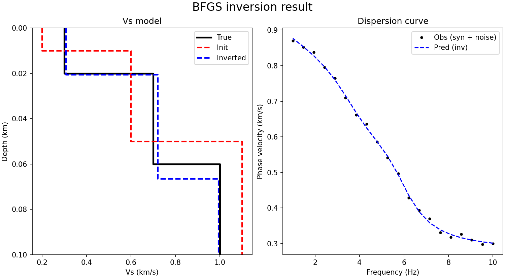
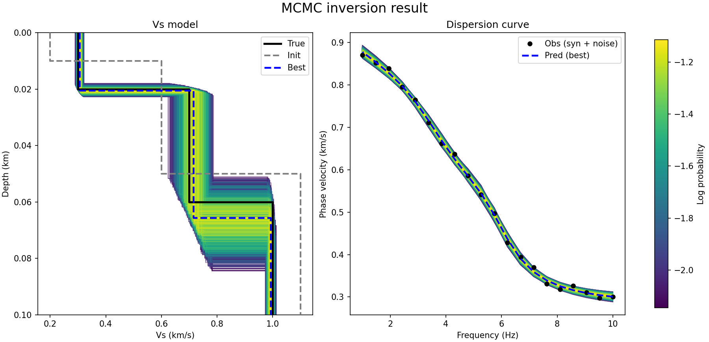

# dispinv
A simple demo repository for surface-wave dispersion inversion using several optimization strategies.

This project is intended for **initial learning and testing** of 1D layered-model inversion for Rayleigh-wave phase velocity dispersion curves. It now includes forward modeling and three inversion approaches:

- **Least Squares**
- **BFGS**
- **MCMC**


## Features

- Simple layered-earth parameterization:  
  `parameters = [thk(n-1), vs(n)]`
- Forward calculation of Rayleigh-wave phase velocity dispersion
- Conversion from inversion parameters to a full model:  
  `[thk, vp, vs, rho]`
- Example inversion workflows in Python / notebook form

## Repository structure

- `subfunctions.py`  
  Core utility functions, including:
  - parameter-to-model conversion
  - forward dispersion calculation

- `BFGS.py`  
  Dispersion inversion using the BFGS optimization method

- `Least_squares.py`  
  Dispersion inversion using `scipy.optimize.least_squares`

- `MCMC_inversion.py`  
  Dispersion inversion using `emcee` for posterior sampling

- `demo.ipynb`  
  Example notebook for testing and visualization

## Dependencies

This project depends on:

- `numpy`
- `scipy`
- `matplotlib`
- `emcee`
- `disba`

You can install them with:

```bash
pip install numpy scipy matplotlib emcee disba
```


## Quick example

```python
from MCMC_inversion import run_mcmc
import numpy as np

mode = 0

thk0 = np.array([0.01, 0.04])     # km
vs0  = np.array([0.2, 0.6, 1.1])  # km/s
n_layers = len(vs0)

x0 = np.r_[thk0, vs0]

sampler = run_mcmc(
    observed_periods=syn_period,
    observed_velocity=syn_velocity,
    mode=mode,
    x0=x0,
    n_layers=n_layers,
    sigma=0.02,
    nwalkers=100,
    nsteps=500
)
```

See demo.ipynb for a more complete example with plotting.

## Notes
- This repository is mainly a demo codebase for learning
- The current implementation is designed for simple 1D layered models
- The inversion setup, parameter bounds, and empirical relations should be adjusted depending on the target problem
- MCMC results should generally be interpreted with burn-in removal and convergence checks in real applications


